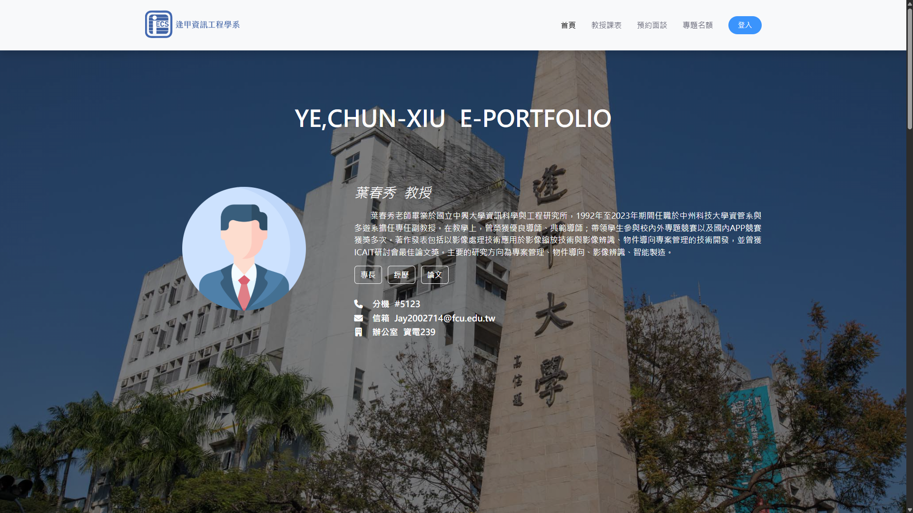
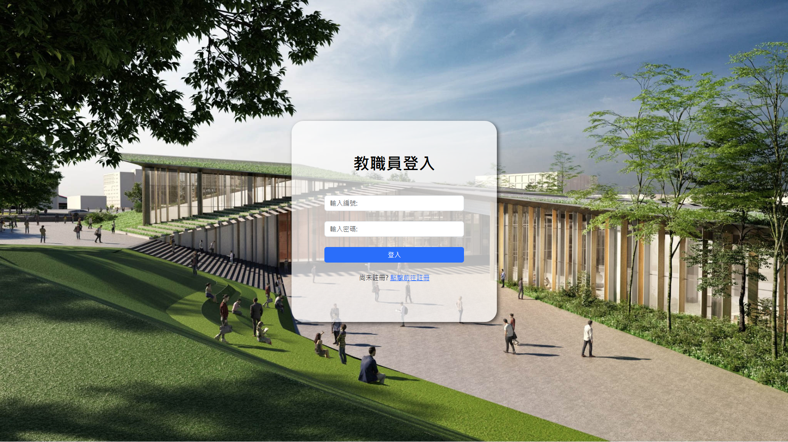
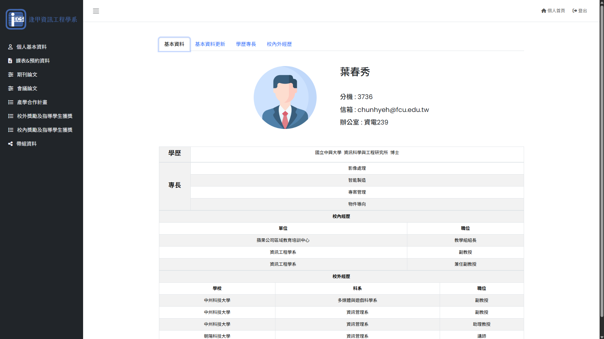
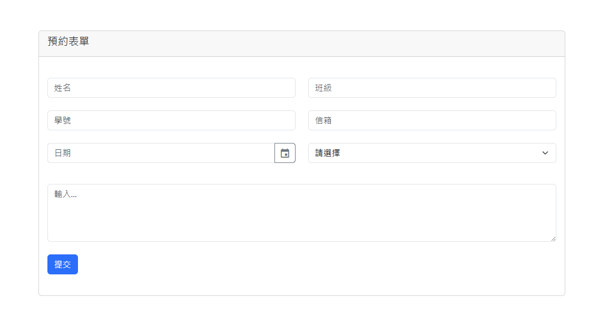
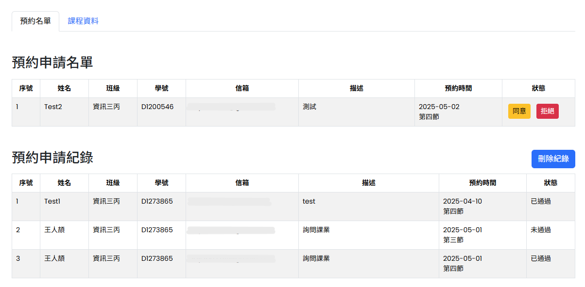
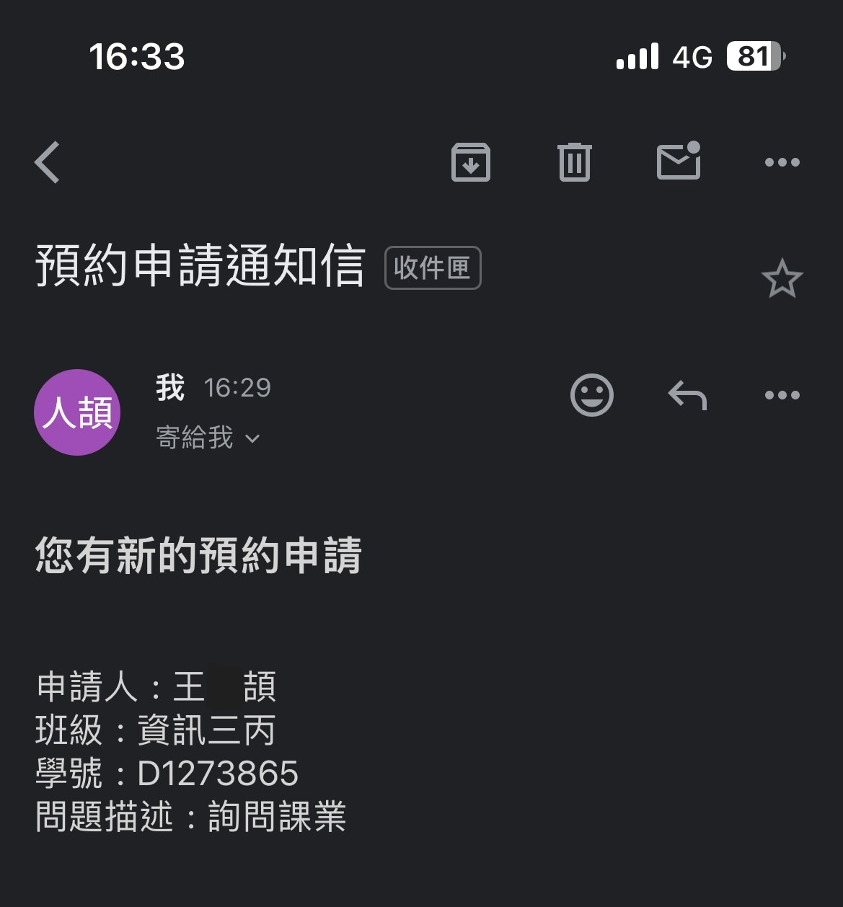
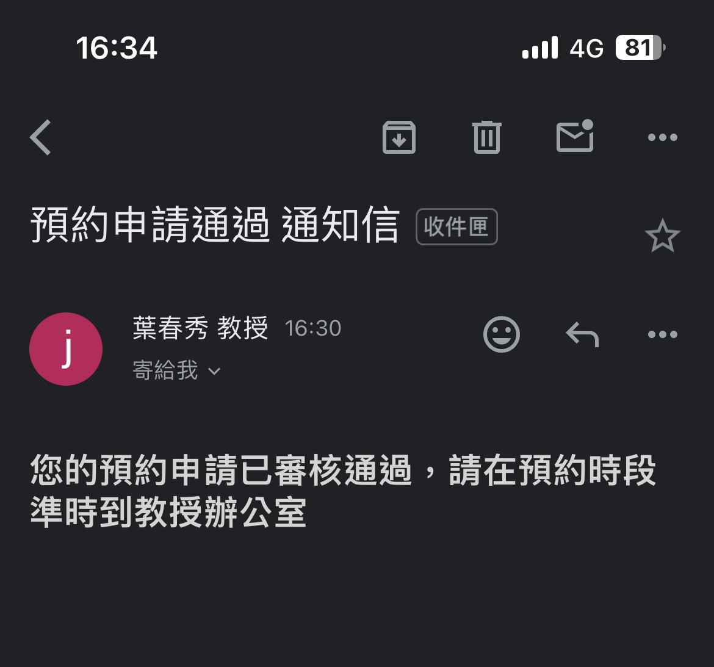

<h1 align="center">Professor personal website</h1>

  該專案為建立教授個人網站，並且可由後台進行資料維護 | <a href="https://youtu.be/bMsJG-BecxE" target="_blank">Demo 影片</a> 
  內容資料來源為 <a href="https://www.iecs.fcu.edu.tw/teacher/#FT" target="_blank">逢甲大學系所成員</a> 公開資訊

    
    
    
    

### 前端頁面

### 登入系統

### 後端頁面

### 預約系統
使用PHPMailer傳送預約申請通知信件

- 預約表單填寫 & 後台名單顯示
    

        
查看圖片

        
        
    

- gmail預約通知格式
    

        
查看圖片

        

            
            
        

    

